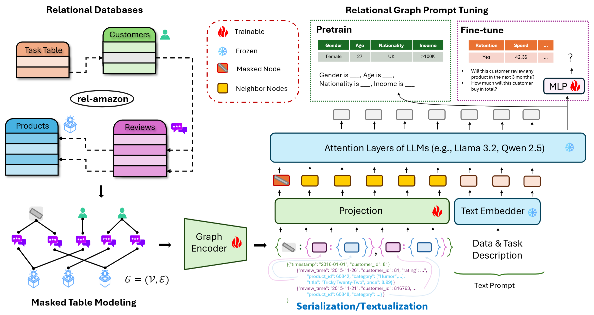

# Rel-LLM: Large Language Models for Relational Database Learning (ACL 2025)

[](https://relbench.stanford.edu)
[]()
[](https://opensource.org/licenses/MIT)

**Rel-LLM** is a framework that enables large language models (LLMs) to perform reasoning and prediction over structured relational databases. Built on top of [RelBench](https://relbench.stanford.edu), Rel-LLM combines graph neural networks (GNNs), temporal-aware subgraph sampling, and prompt-based conditioning for frozen LLMs.

This repository supports our ACL 2025 paper:
> *"Large Language Models are Good Relational Learners"*

---

## 🌟 Highlights

- 🔗 **Relational + Language Modeling**: Bridges multi-table relational structure with LLM reasoning capabilities.
- 🧠 **GNN-Augmented Prompting**: Uses temporal-aware GraphSAGE and projection to format structured prompts.
- 📊 **Full Benchmark Support**: Covers all 7 RelBench datasets and 30 diverse tasks.
- 🧪 **Zero-shot & Finetuned**: Supports both inference-only and parameter-efficient finetuning regimes.
- ⚙️ **GNN and LLM Interoperability**: Easy comparison with traditional GNN-only methods.

---

## 🧩 Architecture



**Rel-LLM Workflow**:
1. Construct a heterogeneous entity graph from relational tables.
2. Sample temporal-aware subgraphs at each prediction time point.
3. Encode graph structure using a GNN (e.g., GraphSAGE).
4. Project embeddings to LLM space and serialize as JSON prompts.
5. Decode answers using frozen LLM with optional soft prompting.

---

## 📦 Installation

Install dependencies at once:
```bash
pip install -r requirements.txt
```

Alternatively, manually install packages in turn:
```bash
conda create -n RDL python=3.10 && conda activate RDL
pip install torch==2.5.0 torchvision==0.20.0 torchaudio==2.5.0 --index-url https://download.pytorch.org/whl/cu124
pip install wandb pandas pillow pyarrow pooch
pip install relbench
pip install torch-frame 
pip install -U sentence-transformers   # for Glove 
pip install transformers peft
```

To enable modeling features via RelBench:
```bash
pip install relbench[full]
pip install pytorch_frame[full]  
```

Here, `Llama-3.1` is leveraged. Please log in to Huggingface for downloading the model weights directly. 


## 🧪 Example Commands
**rel-event** (classification):

```bash
python main.py --dataset=rel-event --task=user-ignore --epochs=3 --batch_size=2 \
  --lr=0.0001 --dropout=0.2 --llm_frozen --context --context_table=event_attendees
```

**rel-amazon** (regression):
```bash
python main.py --dataset=rel-amazon --task=user-ltv --epochs=10 --batch_size=1 \
  --lr=0.0001 --dropout=0.2 --context --temporal_strategy=last \
  --max_new_tokens=3 --text_embedder=mpnet
```

More example commands are available in `train_script.txt`.
> Add `--debug` to disable Weights & Biases tracking.


## 📚 Datasets

Rel-LLM supports all 7 datasets and 30 tasks from [RelBench](https://relbench.stanford.edu):

- 🏟 `rel-event`: Social event participation and churn
- 🛍 `rel-amazon`: E-commerce user behavior and item lifespan
- 💬 `rel-stack`: QA forum engagement and reputation prediction
- 🧾 `rel-avito`: Ad visits and clickthrough prediction
- 🏎 `rel-f1`: Racing analytics for drivers and outcomes
- 🛒 `rel-hm`: H&M fashion sales forecasting
- 🧪 `rel-trial`: Clinical trial success and adverse outcomes


---

## 📈 Results Summary

Rel-LLM significantly outperforms traditional baselines and in-context learning (ICL) methods on entity-level classification and regression tasks.

- **Classification (AUROC ↑)**: +2 point gain over RDL and ICL+MLP

- **Regression (MAE ↓)**: Lowest average MAE across tasks (12.31)

- **Zero-shot Viability**: Rel-Zero performs competitively without labels

---

## 📖 Citation

Please cite our work if you find it useful:

    @article{wu2025large,
    title={Large Language Models are Good Relational Learners},
    author={Wu, Fang and Dwivedi, Vijay Prakash and Leskovec, Jure},
    journal={arXiv preprint arXiv:2506.05725},
    year={2025}
    }

And also cite RelBench:

    @misc{relbench,
      title={RelBench: A Benchmark for Deep Learning on Relational Databases},
      author={Robinson, Joshua and Ranjan, Rishabh and Hu, Weihua and Huang, Kexin and Han, Jiaqi and Dobles, Alejandro and others},
      year={2024},
      eprint={2407.20060},
      archivePrefix={arXiv},
      primaryClass={cs.LG}
    }

---

## 🤝 Acknowledgements

This work builds on the excellent [RelBench](https://github.com/snap-stanford/relbench) benchmark and draws inspiration from literature on retrieval-augmented generation (RAG), prompt tuning, and relational deep learning.

For questions, please open an issue or reach out to the authors (`fangwu97@stanford.edu`).


